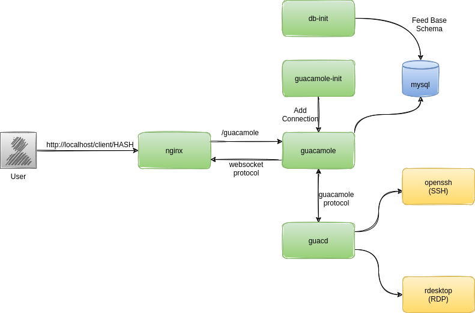

# Guacamole + Nginx + RDP & SSH Connections

## Table of Contents

- [Guacamole + Nginx + RDP \& SSH Connections](#guacamole--nginx--rdp--ssh-connections)
  - [Table of Contents](#table-of-contents)
  - [Overview](#overview)
  - [Prerequisites](#prerequisites)
  - [How to Use](#how-to-use)
  - [Architecture](#architecture)
  - [Version Information](#version-information)
  - [Previous Releases](#previous-releases)
  - [Key Features](#key-features)
  - [Author](#author)

## Overview

This is a Docker Compose stack that includes:

* Guacamole with MySQL as a datasource
* Nginx as a reverse proxy
* Automatically adds example SSH and RDP connections

## Prerequisites

* Docker 19.03.13 or latest
* Docker compose 1.29.2 or latest

## How to Use

### Start Guacamole

To start Guacamole without the test devices (openssh, rdesktop):

```bash
docker compose up -d
```

### Start Guacamole with Test Devices

To start Guacamole along with `openssh` and `rdesktop` containers for testing:

```bash
docker compose --profile devices up -d
```

### Validation

1.  **Access Guacamole**: Open your browser and navigate to `http://localhost:8080/`.
2.  **Login**: Use default credentials:
    -   Username: `guacadmin`
    -   Password: `guacadmin`
3.  **Verify Connections**:
    -   You should see `openssh-ssh` and `rdesktop-rdp` connections if you started with the `devices` profile.
    -   Click on them to verify connectivity.
4.  **Verify SFTP**:
    -   The connections remain configured with SFTP support enabled.

## Architecture



Refer to the [Guacamole documentation](https://guacamole.apache.org/doc/gug/guacamole-architecture.html) for more details.

## Version Information

The following versions are used in this setup:

* Guacamole 1.6.0
* MySQL 8.0.26
* Nginx 1.21.1

## Previous Releases

- [v1.3.0](https://github.com/arulrajnet/guacamole-compose/releases/tag/v1.3.0)
- [v1.4.0](https://github.com/arulrajnet/guacamole-compose/releases/tag/v1.4.0)
- [v1.5.5](https://github.com/arulrajnet/guacamole-compose/releases/tag/v1.5.5)

## Key Features

The key features of this setup include:

* `db-init` exports the base schema into a Docker volume
* MySQL uses that Docker volume for database initialization
* The Guacamole container starts up once MySQL and guacd become healthy
* The Guacamole init container adds SSH and RDP connections within the same Docker network

## Author

<p align="center">
  <a href="https://x.com/arulrajnet">
    
  </a>
  <br>
  <strong>Arul</strong>
  <br>
  <a href="https://x.com/arulrajnet">
    
  </a>
  <a href="https://github.com/arulrajnet">
    
  </a>
  <a href="https://linkedin.com/in/arulrajnet">
    
  </a>
</p>
